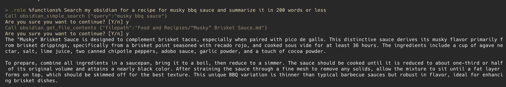

Recently, I spent some time setting up the impressive [`aichat`](https://github.com/sigoden/aichat)
project on my machine, even integrating it with some MCP servers. If you've read my previous posts,
you know I'm a big fan of the Nix [home-manager](https://nix-community.github.io/home-manager/)
project for managing my tools—so this guide focuses on using it. That said, I'm not doing anything
overly Nix-specific with this setup; the instructions here can be implemented manually or automated
with a script. This guide assumes that aichat is installed either via your home-manager packages or
by following [the installation instructions in the
repo](https://github.com/sigoden/aichat?tab=readme-ov-file#install).

Most of the code in this repo is found in my `home.activation` block of my home-manager `home.nix`
file, which you can reference
[here](https://github.com/thomastaylor312/home-manager/blob/c6fa2a046b300c30792caef42221fd9913d6da28/home.nix#L277).

## Configuration

One challenge in configuring your aichat setup is that it requires secrets to connect to various LLM
providers. You can read a more detailed explanation of my hacky, but serviceable workaround I use in
a [previous blog post](../poor-mans-secret-management-in-nix).

Here is the full block of my step for setting up config:

```nix
setupAichatConfig = lib.hm.dag.entryAfter [ "writeBoundary" ] ''
        run mkdir -p "$HOME/Library/Application Support/aichat"
        yaml_path="$HOME/Library/Application Support/aichat/config.yaml"
        run rm -f "$yaml_path"
        run cat > "$yaml_path" << 'EOF'
  model: openrouter:openai/gpt-4o
  function_calling: true
  rag_embedding_model: ollama:nomic-embed-text
  clients:
  - type: openai-compatible
    name: openrouter
    api_base: https://openrouter.ai/api/v1
    api_key: <REPLACE ME>
  - type: openai-compatible
    name: ollama
    api_base: http://localhost:11434/v1
    models:
    - name: nomic-embed-text
      type: embedding
    - name: phi4:14b-q8_0
      max_input_tokens: 16000
  EOF
        run ${pkgs._1password-cli}/bin/op read --account ZYK5R7INKFEFBMCZGVCN7TTLSQ "op://Private/aichat-openrouter-token/credential" | run xargs -I{} sed -i"" 's/<REPLACE ME>/{}/g' "$yaml_path"
        run chmod 400 "$yaml_path"
'';
```

You can probably already tell that this is a simple bash script, but let's break it down. First
thing to note, regardless of whether or not you do this in nix, is that the config file is located
at `$HOME/Library/Application Support/aichat/config.yaml`. I'm constantly annoyed that some CLI
applications on Mac follow XDG specifications and store them in the `$HOME/.config` directory, while
others store them in the `$HOME/Library/Application Support/` directory. But that's a different rant
for a different day.

The last part of the script is my hacky trick to substitute the OpenRouter API token `aichat` uses
to connect and then modifies the file permissions to be readonly. The real thing to learn here is
breaking down the other options in the actual config.

The `model` key is the default model for `aichat` to use. I chose gpt-4o because it is relatively
quick, though I might swap it out to o3 mini. Please keep in mind this is purely the default, so you
can easily override it using command line flags, REPL commands, or environment variables later on.
You'll also note that I turn on `function_calling` by default. We'll cover function setup in a later
section. The other interesting part here is the `rag_embedding_model` option. `aichat` has a nice
built in RAG (retrieval augmented generation) system that allows you to [generate
embeddings](https://github.com/sigoden/aichat/wiki/RAG-Guide#document-sources) for any arbitrary set
of documents. This option configures the model to use for embedding generation. It is also why I
have ollama configured as an option in the `clients` section of the config. If you use OpenRouter or
one of the other common providers, you do not have to specify available models. However, if you're
using an OpenAI compatible model like Ollama, you have to specify which models are available. I have
my embedding model and the Phi4 model available for when I need local LLM access for private data or
text summarization.

## Function/Tool Calling

This is where things get more interesting, especially if you're using Nix. One drawback of aichat is
that it uses its own system for defining functions and tools:
https://github.com/sigoden/llm-functions. Luckily, it supports bridging to any MCP server with a few
extra steps.

I leverage my `home-manager` with flake support, which simplifies the process. I include the
llm-functions repository as an input to my flake, specifying `flake = false` since it doesn't have a
`flake.nix` file:

```nix
llm-functions = {
  url = "github:sigoden/llm-functions/main";
  flake = false;
};
```

Then, you have to pass through the input into the `modules` section of your home-manager config:

```nix
homeConfigurations."oftaylor" =
  home-manager.lib.homeManagerConfiguration {
    inherit pkgs;

    modules = [
      (import ./home.nix {
        inherit pkgs;
        importPath = ./personal;
        lib = home-manager.lib;
        llmFunctionsPath = llm-functions; # <---- right here
      })
    ];
  };
```

I then add this to my home directory inside of the `Application Support` directory using the
[`home.file`](https://github.com/thomastaylor312/home-manager/blob/c6fa2a046b300c30792caef42221fd9913d6da28/home.nix#L241)
option:

```nix
"Library/Application Support/aichat/functions" = {
  source = llmFunctionsPath;
  recursive = true;
  force = true;
};
```

> **NOTE**
> If you're unfamiliar with the `home.file` option, it is a way to copy files into your home
> directory. All of the keys in the map are relative to your home directory.

Once the repo is in place, there are a few more files you need to create to configure the
llm-functions to work properly. We'll use `home.file` again to put those into place.

```nix
"Library/Application Support/aichat/functions/tools.txt".text = ''
  execute_command.sh
  fs_cat.sh
  fs_ls.sh
  fs_mkdir.sh
  fs_patch.sh
  fs_rm.sh
  fs_write.sh
  get_current_time.sh
  get_current_weather.sh
  search_arxiv.sh
  search_wikipedia.sh
'';
"Library/Application Support/aichat/functions/agents.txt".text = ''
  coder
'';
```

The first file is the most important one as it configures the tools available for `aichat`. These
are the built-in tools provided by the llm-functions repo that I chose to enable. While not strictly
necessary, using these tools means you won’t have to include them via MCP later. You can find all of
these tools in the llm-functions repo. The second file is a workaround. Although I don't currently
use any agents, an error is raised if this file is missing at least one entry.

Once that is all in place, we need to put together the `mcp.json` file. I once again used my hack
to configure this file with the necessary tokens:

```nix
in lib.hm.dag.entryAfter [ "writeBoundary" "installPackages" ] ''
  json_file="$HOME/Library/Application Support/aichat/functions/mcp.json"
  run rm -f "$json_file"
  export PATH="${pkgs.argc}/bin:${pkgs.nodejs_22}/bin:${pkgs.uv}/bin:$PATH"
  run cat > "$json_file" << 'EOF'
    {
      "mcpServers": {
        "github": {
          "command": "npx",
          "args": [
            "-y",
            "@modelcontextprotocol/server-github"
          ],
          "env": {
            "GITHUB_PERSONAL_ACCESS_TOKEN": "<REPLACE ME>",
            "PATH": "<PATH>"
          },
          "disabled": false,
          "autoApprove": []
        },
        "obsidian": {
          "command": "uvx",
          "args": [
            "mcp-obsidian"
          ],
          "env": {
            "OBSIDIAN_API_KEY":"<REPLACE ME2>",
            "PATH": "<PATH>"
          }
        }
      }
    }
  EOF
  run ${pkgs._1password-cli}/bin/op read --account ZYK5R7INKFEFBMCZGVCN7TTLSQ "op://Private/mcp-github-token/credential" | run xargs -I{} sed -i"" 's/<REPLACE ME>/{}/g' "$json_file"
  run ${pkgs._1password-cli}/bin/op read --account ZYK5R7INKFEFBMCZGVCN7TTLSQ "op://Private/obsidian-rest-api/credential" | run xargs -I{} sed -i"" 's/<REPLACE ME2>/{}/g' "$json_file"
  run sed -i"" "s|<PATH>|$PATH|g" "$json_file"
  run chmod 400 "$json_file"

  run ${buildScript}/bin/build-llm-functions
'';
```

Once again you'll see the sed substitution to put in the tokens, but otherwise this is a fairly
unremarkable configuration for MCP. It is placed in the same directory as the other files and then
we run this magical `buildScript` thing. "What is that?" you might ask, well, it is a wrapper script
that does all the setup for the functions and MCP servers:

```nix
buildScript = pkgs.writeShellScriptBin "build-llm-functions" ''
  #!/usr/bin/env bash
  export PATH="${pkgs.argc}/bin:${pkgs.nodejs_22}/bin:${pkgs.uv}/bin:$PATH"

  FUNCTIONS_DIR="$HOME/Library/Application Support/aichat/functions"

  # First, let's make actual copies of the symlinked files
  echo "Creating real copies of symlinked files..."
  cd "$FUNCTIONS_DIR/mcp/bridge"

  # Replace symlinks with actual copies. This funky thing is to avoid issues with finding the
  # installed packages because the file exists in nix
  for file in index.js package.json README.md; do
    if [ -L "$file" ]; then
      # Get the target of the symlink
      target=$(readlink "$file")
      # Remove the symlink
      rm "$file"
      # Copy the actual file
      cp "$target" "$file"
    fi
  done

  # Now we can run npm install
  npm install

  # Return to the main directory and continue with build
  cd "$FUNCTIONS_DIR"
  argc build
  argc check
'';
```

The tricks here are that we add paths from nixpkgs to the PATH variable so that we can use them in
the script. The hard part, which took me a while to figure out, was that if we used the symlinked
version, the `npm` commands would fail because they would be trying to locate files relative to the
file's directory. For the core files, we unlink them and copy them into the directory. It’s a bit of
a hack, but it works. `npm install` then retrieves all the dependencies for the functions/bridge
server. The remainder of the script simply runs the `argc` commands to build, check, and link the
files for the functions and MCP servers.

## Running aichat

The final step is to ensure that the MCP server and the llm-functions bridge are running when you
start aichat. I could have gone further by creating a persistent service, but I opted to keep it
simple and wrote a wrapper script that I aliased to `aichat`:

```nix
"aichat.sh" = {
  executable = true;
  text = ''
    #!/usr/bin/env bash
    pushd $HOME/Library/Application\ Support/aichat/functions && argc mcp start 1> /dev/null && popd && command aichat "$@" < /dev/stdin
  '';
};
```

The `argc mcp start` command starts the MCP server and automatically launches the llm-functions
bridge server if it's not already running. It then forwards all arguments and standard input to
`aichat`.

## Some example commands

Now, I can use `aichat` similarly to how I use Claude Desktop or ChatGPT. I haven't really messed
with multimodal stuff yet, so I can't quite report on how that feature set works. But this setup
works well and let's me do things like loading context from my [Obsidian](https://obsidian.md/)
vault.



You can also do some cool things like executing commands in the shell:

```bash
❯ aichat -e 'list all files in my Documents directory'
ls ~/Documents
> execute | revise | describe | copy | quit: e
 code
```

The [aichat wiki](https://github.com/sigoden/aichat/wiki) has plenty of interesting examples in
addition to these, so check it out!

## Bonus: Running commands as natural language

For fun, I discovered that aichat [offers several shell
integrations](https://github.com/sigoden/aichat/tree/main/scripts/shell-integration) for converting
natural language into commands. I use Zsh, and I integrated the script into my home-manager setup by
adding it to my .zshrc. Initially, the included script didn't work on macOS due to piping issues
with the `aichat -e` command. However, the `-e` flag is basically a nice wrapper around the
`%shell%` built in role, so I modified it to use that instead and it now works flawlessly. Here is
the full code for reference:

```zsh
_aichat_zsh() {
    if [[ -n "$BUFFER" ]]; then
        local _old=$BUFFER
        BUFFER+="⌛"
        zle -I && zle redisplay
        BUFFER=$(command aichat -r '%shell%' "$_old")
        zle end-of-line
    fi
}
zle -N _aichat_zsh
bindkey '\ee' _aichat_zsh
```

With this, I can type a natural language query into my terminal, hit option+e, and then it will take
that query and replace it with the actual command. Pretty handy!
